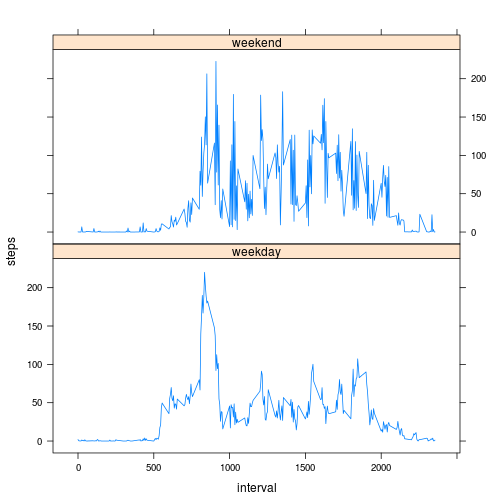

# Reproducible Research: Peer Assessment 1

Firstly, set global option.

```r
opts_chunk$set(echo = TRUE)
```


## Loading and preprocessing the data

* Unzip and read csv file.

```r
unzip("activity.zip")
data <- read.csv("activity.csv")
```

* Pickup non NA record.


```r
compdata <- data[complete.cases(data), ]
```


## What is mean total number of steps taken per day?

* Calculate sum of steps for each day.


```r
tdata <- tapply(data$steps, data$date, sum)
```


* Show histgram.

```r
hist(tdata, main = "Number of Steps Histgram", xlab = "Total Number of Steps")
```

 


* Calculate the mean and median total number of steps taken per day


```r
summary(tdata)
```

```
##    Min. 1st Qu.  Median    Mean 3rd Qu.    Max.    NA's 
##      41    8840   10800   10800   13300   21200       8
```


## What is the average daily activity pattern?

* Make a time series plot (i.e. type = "l") of the 5-minute interval (x-axis) and the average number of steps taken, averaged across all days (y-axis)

```r
tdata2 <- tapply(compdata$steps, compdata$interval, mean)
plot(names(tdata2), tdata2, type = "l", main = "average number of steps", xlab = "interval", 
    ylab = "steps")
```

 


* Maximum number of steps


```r
tdata2[which.max(tdata2)]
```

```
##   835 
## 206.2
```


## Imputing missing values

* Calculate and report the total number of missing values in the dataset (i.e. the total number of rows with NAs)

```r
sum(!complete.cases(data))
```

```
## [1] 2304
```


* Devise a strategy for filling in all of the missing values in the dataset. Filling values are the mean for that 5-minute interval.


```r
data$steps2 <- ifelse(is.na(data$steps), tdata2[as.character(data$interval)], 
    data$steps)
```


* Create a new dataset using filling values.


```r
filldata <- data.frame(steps = data$steps2, date = data$date, interval = data$interval)
```


* Calculate and show histgram.


```r
tfilldata <- tapply(filldata$steps, filldata$date, sum)
hist(tfilldata, main = "Number of Steps Histgram (fill data)", xlab = "Total Number of Steps")
```

 


* Calculate the mean and median


```r
summary(tfilldata)
```

```
##    Min. 1st Qu.  Median    Mean 3rd Qu.    Max. 
##      41    9820   10800   10800   12800   21200
```


## Are there differences in activity patterns between weekdays and weekends?

* Add weekday column


```r
filldata$weekday <- ifelse(weekdays(as.Date(filldata$date)) == c("Saturday", 
    "Sunday"), "weekend", "weekday")
```

* Separate dataset by weekday

```r
weekdaydata <- filldata[filldata$weekday == "weekday", ]
weekenddata <- filldata[filldata$weekday == "weekend", ]
```


* Calculate mean steps for weekday and weekend. 


```r
tweekday <- tapply(weekdaydata$steps, weekdaydata$interval, mean)
tweekendday <- tapply(weekenddata$steps, weekenddata$interval, mean)
dweekday <- data.frame(interval = names(tweekday), steps = tweekday, week = rep("weekday", 
    length(tweekday)))
dweekend <- data.frame(interval = names(tweekendday), steps = tweekendday, week = rep("weekend", 
    length(tweekendday)))
dweek <- rbind(dweekday, dweekend)
```


* Plot weekday and weekend data


```r
dweek$interval <- as.numeric(as.character(dweek$interval))
library(lattice)
xyplot(steps ~ interval | week, dweek, type = "l", layout = c(1, 2))
```

 

